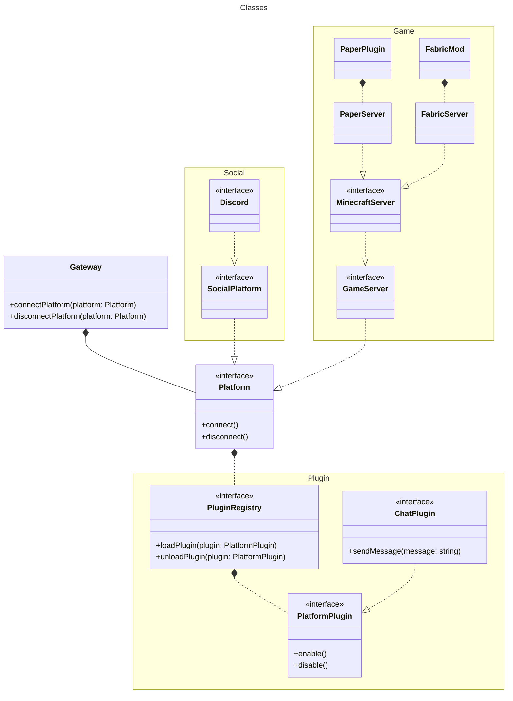

# Overview

```mermaid
---
title: Classes
---
classDiagram
    class Gateway {
        +connectPlatform(platform: Platform)
        +disconnectPlatform(platform: Platform)
    }

    class Platform {
        <<interface>>
        +connect()
        +disconnect()
    }

    Gateway *-- Platform

    namespace Plugin {
        class PluginRegistry {
            <<interface>>
            +loadPlugin(plugin: PlatformPlugin)
            +unloadPlugin(plugin: PlatformPlugin)
        }

        class PlatformPlugin {
            <<interface>>
            +enable()
            +disable()
        }

        class ChatPlugin {
            <<interface>>
            +sendMessage(message: string)
        }
    }

    Platform *.. PluginRegistry
    PluginRegistry *.. PlatformPlugin
    ChatPlugin ..|> PlatformPlugin

    namespace Social {
        class SocialPlatform {
            <<interface>>
        }

        class Discord {
            <<interface>>
        }
    }

    SocialPlatform ..|> Platform
    Discord ..|> SocialPlatform

    namespace Game {
        class GameServer {
            <<interface>>
        }

        class MinecraftServer {
            <<interface>>
        }

        class PaperServer {
        }

        class PaperPlugin {
        }

        class FabricServer {
        }

        class FabricMod {
        }
    }

    GameServer ..|> Platform
    MinecraftServer ..|> GameServer
    PaperServer ..|> MinecraftServer
    PaperPlugin *.. PaperServer
    FabricServer ..|> MinecraftServer
    FabricMod *.. FabricServer
```
