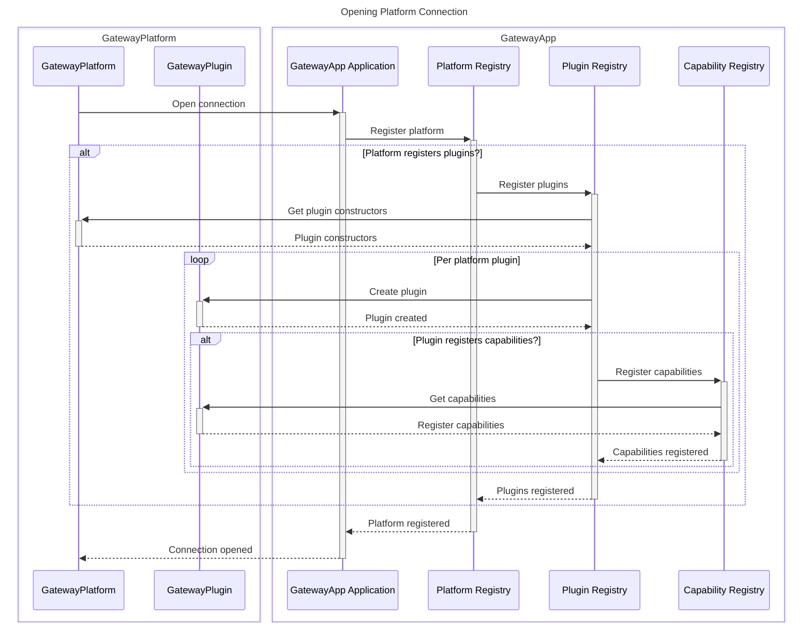
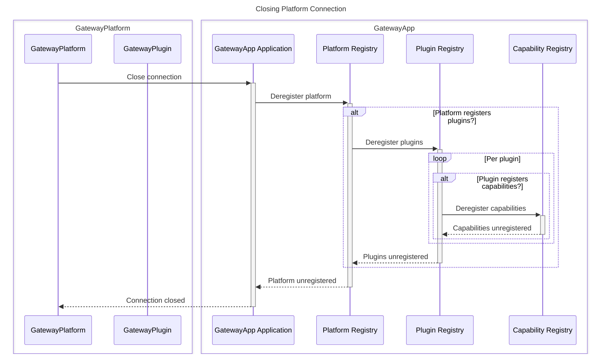
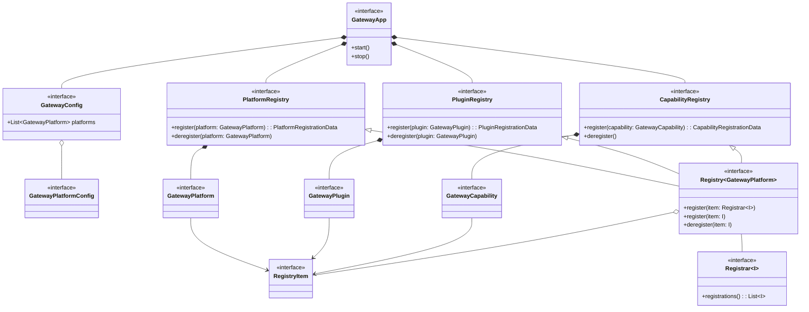
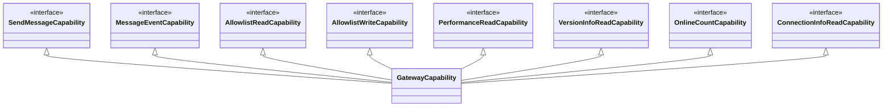
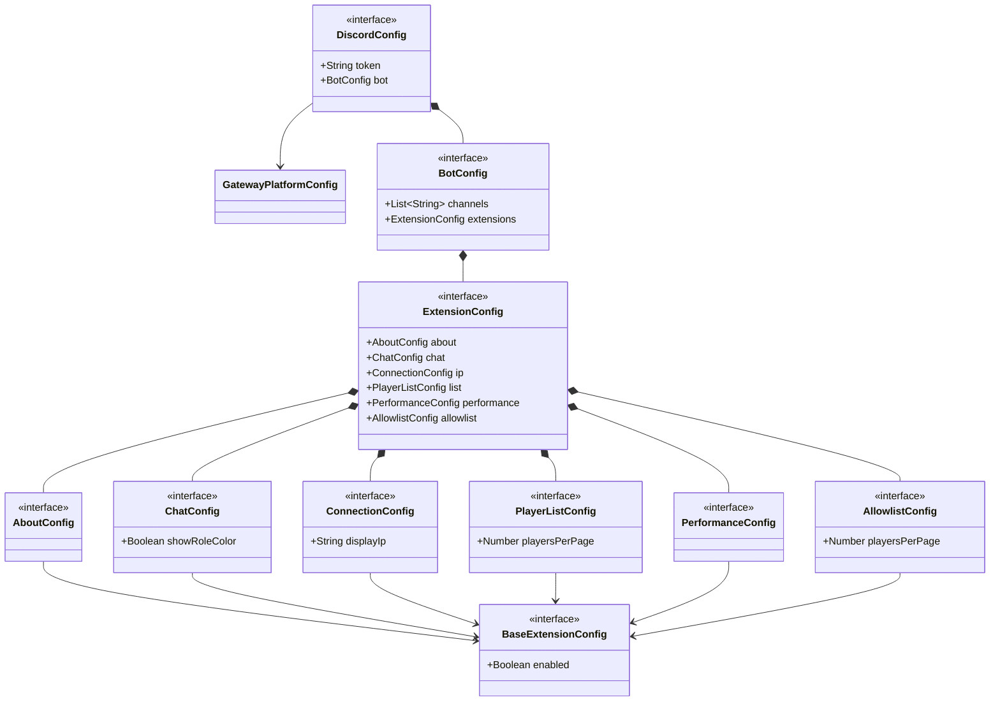
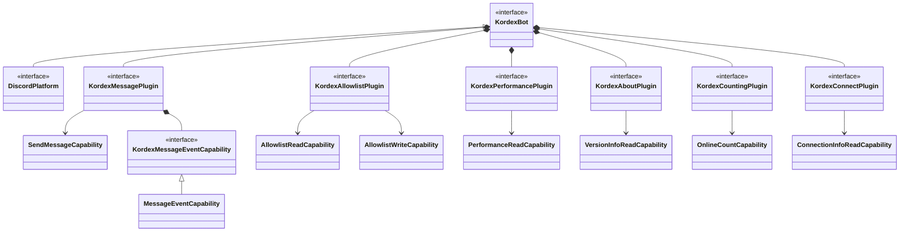
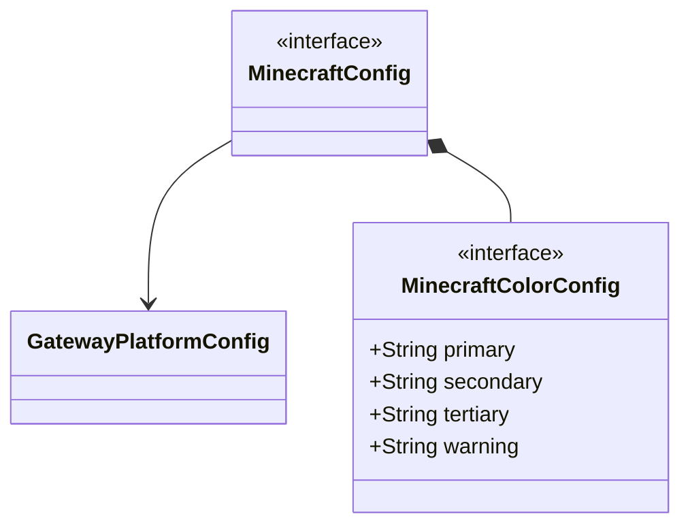
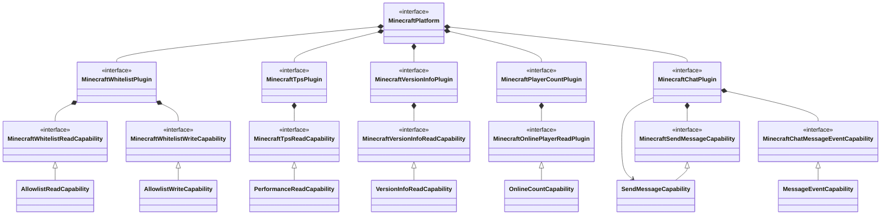
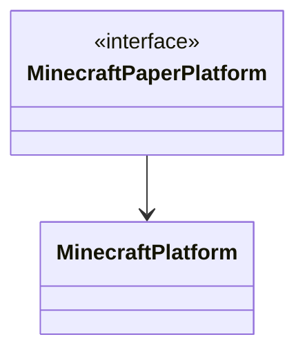
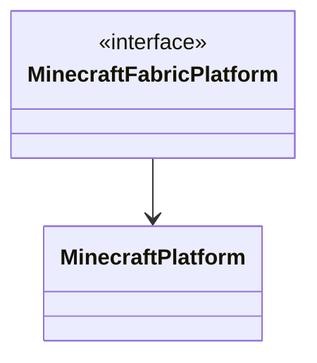

# Overview

## Platforms, Plugins, and Capabilities

The GatewayApp application uses various abstractions as ways to group related functionality and ensure portable logic
between applications.
The primary abstractions used are platforms, plugins, and capabilities.

## Platforms (GatewayPlatform)

Platforms are "the things that connect to GatewayApp".
They could also be thought of as "third parties".

### Platform Examples

* Minecraft
* Discord

### Platform Logic

## Capabilities (GatewayCapability)

If platforms are "what are we connecting to", capabilities are "what can we do with this connection".
Capabilities are how we access platform-specific as well as general functionality.

### Capability Examples

* Getting the list of online players in Minecraft
* Sending a message
* Parsing a message from a particular platform

## Plugins (GatewayPlugin)

Plugins are less directly tied to the concept of a platform.
Plugins group related pieces of functionality together for ease of organization or reasoning.

### Plugin Examples

* Minecraft whitelist functionality
* Handling of messages from a particular platform

## Registry Management

Gateway has transitioned to using [Koin](https://insert-koin.io/) for dependency injection and registry management. 
Registries for platforms, plugins, and capabilities are now managed as Koin modules, providing a more robust and flexible way to handle component lifecycles and dependencies.

## Organization

### GatewayApp App

#### Overall

#### Generic Capabilities

### Discord Platform

#### Discord Config

#### Overall Discord Platform

### Minecraft Platforms

#### Minecraft Config

#### Overall Minecraft Platform

#### Paper Platform

#### Fabric Platform

